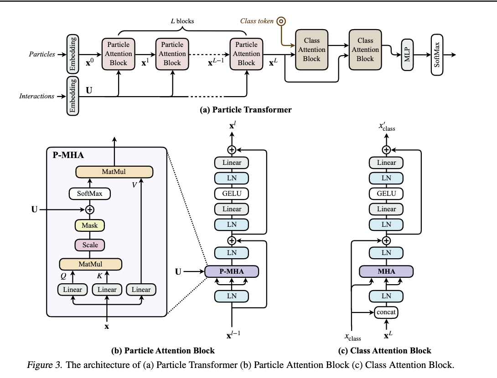

This looks at the code underlying `particle_transformer`.

We'll start with the `main` function called by the `weaver` command (obtained after `pip` installing `weaver-core` or running `setup.py` from the root of the `weaver-core` repo) and then work out at which point a forward pass for our ParticleTransformer model is called.

Essentially trying to isolate the path to loading a model instance and calling a forward pass here.

So this means putting an untrained model in "inference" mode - turn off backward passes and feed input into the model.

We have "ready trained" models that are available to also use - see if model weight has any bearing on forward pass memory or compute consumption. Ideally we'll run this locally on a CPU first, before profiling on a GPU.


## main function - training pipeline
Called by the `weaver` command
parses arguments - everything passed to weaver. What do we actually pass? A reworked example from the suggested `train_JetClass.sh` script in the `particle_transformer` repo is below:

```sh
weaver --data-train 'HToBB:./datasets/JetClass/Pythia/train_100M/HToBB_*.root' --data-val './datasets/JetClass/Pythia/val_5M/HToBB_*.root' --data-test 'HToBB:./datasets/JetClass/Pythia/test_20M/HToBB_*.root' --data-config data/JetClass/JetClass_full.yaml --network-config networks/example_ParticleTransformer.py --use-amp --model-prefix 'training/JetClass/Pythia/full/ParT/{auto}/net' --num-workers 0 --fetch-step 0.0001 --batch-size 128 --start-lr 1e-3 --samples-per-epoch 1024 --samples-per-epoch-val 1280 --num-epochs 1 --gpus 0 --optimizer ranger --log 'logs/JetClass_Pythia_full_ParT_{auto}.log' --predict-output pred.root --tensorboard JetClass_Pythia_full_ParT
```

where `samples-per-epoch` and `samples-per-epoch-val` are reduced to 1024 and 1280, `num-epochs` is reduced to 1, and `num-workers` is set to 0 to reducer complexity and keep things to a single process.

### Definition of arguments passed to weaver

`--data-train` - path to training data
`--data-val` - path to validation data
`--data-test` - path to test data
`--data-config` - path to data config yaml. Which variables do we need from the data? Any selections/cuts to make?
`--network-config` - this is a python file that defines a model wrapper. Here we have `ParticleTransformerWrapper`, supers torch.nn.Module and has a `self.mod` attribute that actually loads the model, defined in `weaver.nn.model.ParticleTransformer` - look here for the actual model architecture. This really is just providing a function `get_model` to load the model with particular parameters set, like embed dimensions, number of heads, number of layers, activation functions etc AND ALSO a function `get_loss`to define the loss as cross entropy loss.
`--use-amp` - flag to define if we should use mixed precision training (fp16). This is set to true if the flag is present.
`--model-prefix` - path to save or load the model.
`--num-workers` Number of workers to use, running a process each. Setting this to zero turns this off and runs as a single process. It's really "number of additional processes" or something like that!
`--fetch-step` - fraction/chunk of events to load from each input file, before being randomly shuffled and fed into the training pipeline. The chunk size is set by this flag and defaults to 0.01, which corresponds to 10% of events (I think actually 1%...) to be loaded from each file in every step. **This is the default strategy** - motivated by physics/HEP experiments, where each input files originates from a specific physics process, and only contains events of a particular type (or in a limited phase space). This is motivated by providing a good mixture of events, but requires high reading throughput of data storage (they suggest SSD), otherwise you have a data loading bottleneck.
`--batch-size`is batch size. Even the argparser doesn't give you more than that!
`--start-lr` the starting learning rate. Not clear what the scheduler is at this stage.
`--samples-per-epoch` - number of samples loaded per epoch. Note that if this isn't set OR `--steps-per-epoch-val` is set, then each epoch will run over all loaded samples. Seems odd to me - surely an epoch is your entire training data set?
`--samples-per-epoch-val` - samples per epoch for validation.  See above for the behaviour if this isn't set OR regular `samples-per-epoch`
`--num-epochs` number of epochs
`--gpus` zero-indexed device for setting which GPUs are used. A blank string here uses the CPU. 0 uses device 0, or the first available GPU.
`--optimizer` - sets the optimizer for the training.
`--log` path to the log file. `{auto}` is allowed and auto generates a name based on timestamp.
`--predict-output` save any prediction output to this path
`--tensorboard` creates a tensorboard summary writer with the given comment


That's it.

### Main function overview
- parses arguments
- sets variables based on args parsed
- importantly, training mode is set with `args.predict` flag. This defaults to False, so passing this flag in turns on prediction mode (and turns off training!)
- if we're training, then a bunch of variables are created (and dataloaders)
- if not, then only test dataloaders and the data config are loaded
- we set up the model
- there's even a `--profile` flag which "run(s) the profiler".
  - this actually uses the torch profiler!


The main function is really bloated and quite messy. Loads of flags. Training loop demarcated by a comment.


Adding the `--profile` flag to our default training command locally (MacOS, M3 chip) results in an output like this:

```sh
[2024-11-14 17:21:00,291] INFO: Computational complexity:       341.56 MMac
[2024-11-14 17:21:00,291] INFO: Number of parameters:           2.14 M  
[2024-11-14 17:21:00,291] INFO: Using loss function CrossEntropyLoss() with options {'use_amp': True}
```

In the main function, we eventually enter the training loop. If it's classification (default), we import the `train_classification` function as `train` - all from weaver. Model has its state dict updated, and we save this after training has finished.

Evaluation is run **at the end of each epoch**. Performance is assessed, and if the last epoch was the best epoch, we save this model at the end as "best_epoch_state.pt"

Then some testing occurs, if we've passed test data in. Much the same occurs here, setting up the model output path and devices.

- The model is loaded to a device
- a test dataloader is instantiated
- the model is evaluated on test data

Finally, if we're running in "predict" mode, then some output may be written.

## Training loop - classification

This is found in `weaver.utils.nn.tools` - both `train_classification` and `train_regression` - let's look at classification only rather than regression, for now.

- tqdm loop (a progress bar) over the training data loader
- inputs are put onto the current device
- labels are put onto the current device
- a mask is obtained from the data labels
- gradients are zeroed
- forward pass, loss calculated from preds
- backpropagation with optimizer update
- total loss calulated
- metrics written out
- if using tensorboard, metrics are added there.

## ParticleTransformer model architecture

A closer look at the model we're attempting to train...

Compound physics variables like angular difference, squared mass and squared transverse momentum are defined early in `weaver.nn.model.ParticleTransformer`and are referred to later in the code. Similar for boosting rest frames. 

`Embed` and `PairEmbed` classes generate embeddings, either pairwise or (I think) for the input layer. From the paper, the particle and interaction inputs are each followed by an MLP to project them to d and d' dimensional embeddings, respectively. No ad-hoc positional encodings are given as particles in a jet are permutation invariant. Particle embeddings are then fed into a stack of attention blocks to generate new embeddings via multi-head self attention.

Pairwise features are encoded separately and I think will use the `PairEmbed` class
No type hinting makes this quite a painful process.

Lots of the classes (particularly the pairwise embedding) could use a refactor.

Define a `Block` class that just contains a forward pass.

The main actual `ParticleTransformer`class is finally defined!




### Forward pass

- Gradient calculation is turned off in a context manager
- build a sparse tensor if we're not running this for inference.
- Otherwise, call sequence trimmer and create a padding mask.

Context manager to allow FP16 use, then generate input embeddings. Permute the indices of these embeddings, and generate an attention mask from the pair embeddings if pair embeddings aren't None.

Blocks are passed in as a list of `ModuleList` and created in a for loop. The blocks all come from

```python
default_cfg = dict(embed_dim=embed_dim, num_heads=num_heads, ffn_ratio=4,

dropout=0.1, attn_dropout=0.1, activation_dropout=0.1,

add_bias_kv=False, activation=activation,

scale_fc=True, scale_attn=True, scale_heads=True, scale_resids=True)
```

which is then updated with `block_params`. See exactly how this is called in the training loop (or ParticleTransformer wrapper) to understand what the block config looks like.


Class tokens are extracted from the `cls_token` argument used to instantiate the class, and again `block` is called in a for loop

Components are essentially

```python
self.embed = Embed(input_dim, embed_dims, activation=activation) if len(embed_dims) > 0 else nn.Identity()

self.pair_embed = PairEmbed(

pair_input_dim, pair_extra_dim, pair_embed_dims + [cfg_block['num_heads']],

remove_self_pair=remove_self_pair, use_pre_activation_pair=use_pre_activation_pair,

for_onnx=for_inference) if pair_embed_dims is not None and pair_input_dim + pair_extra_dim > 0 else None

self.blocks = nn.ModuleList([Block(**cfg_block) for _ in range(num_layers)])

self.cls_blocks = nn.ModuleList([Block(**cfg_cls_block) for _ in range(num_cls_layers)])

self.norm = nn.LayerNorm(embed_dim)
```

`self.fc` is either `None` or a list of `Sequential` objects, which can be either `nn.Linear`, `nn.ReLU` or `nn.Dropout` layers.

at the end of the forward pass, if `self.fc` is None we just return the `LayerNorm` of the `cls_tokens`, with dimensions of size 1 removed.

Otherwise, if `self.fc` is actually a list of `Sequential`s, we return the model output of running the model with the inputs, where `x_cls` is the model input. If we're in inference mode, we then take the softmax of the output.

Other models are available, but this is the core `ParticleTransformer` model.

Model loading is quite opaque, looking in `weaver.train.model_setup`

## Main function - inference

example from the [weaver-core github repo](https://github.com/hqucms/weaver-core):

```sh
weaver --predict --data-test '/path/to/test_files/*/*/*/*/output_*.root' \
 --data-config data/ak15_points_pf_sv.yaml \
 --network-config networks/particle_net_pf_sv.py \
 --model-prefix /path/to/models/prefix_best_epoch_state.pt \
 --gpus 0,1,2,3 --batch-size 512 \
 --predict-output /path/to/output.root
```

This is a reduced list of parameters needed to run the model in inference mode.
